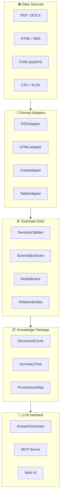

<div align="center">
  <br/>
  <h1>⚡ LitePaperReader</h1>
  <p><strong>Universal Data Flow Intelligence Engine</strong></p>
  <p>
    <em>Type-safe &bull; Traceable &bull; Composable — Process documents, code, and structured data into LLM-consumable knowledge.</em>
  </p>
  <br/>

[](pyproject.toml)
[](LICENSE)
[](https://github.com/ASDNNB/litepaperreader/actions/workflows/test.yml)
[](https://github.com/ASDNNB/litepaperreader/actions/workflows/lint.yml)
[](docker-compose.yml)
[](https://github.com/astral-sh/ruff)
[](CONTRIBUTING.md)

[📖 Documentation](#-documentation) &bull;
[🚀 Quick Start](#-quick-start) &bull;
[🔧 Installation](#-installation) &bull;
[💡 Usage](#-usage) &bull;
[🤝 Contributing](CONTRIBUTING.md)

[🇨🇳 中文文档](README_CN.md)

</div>

---

## 📋 Table of Contents

- [Why LitePaperReader?](#-why-litepaperreader)
- [Architecture](#-architecture)
- [Features](#-features)
- [Installation](#-installation)
- [Quick Start](#-quick-start)
- [Usage](#-usage)
- [MCP Integration](#-mcp-integration)
- [Web UI](#-web-ui)
- [Configuration](#-configuration)
- [FAQ](#-faq)
- [Roadmap](#-roadmap)
- [Contributing](#-contributing)
- [License](#-license)

---

## 🧠 Why LitePaperReader?

Traditional RAG systems treat documents as opaque text blobs — they chunk blindly, embed vaguely, and retrieve by fuzzy similarity. You get an answer but can'"'"'t trace it back to the source.

> **LitePaperReader** flips the script. Instead of guessing, it converts raw data into a **typed, traceable data flow**, extracts structured information, and answers questions with **precise source citations**.

| | Traditional RAG | LitePaperReader |
|---|---|---|
| **Data model** | Opaque text chunks | Typed Cells (TEXT / CODE / TABLE) |
| **Provenance** | Lost after embedding | Every output traces to exact line ranges |
| **Processing** | Fixed pipeline (chunk &rarr; embed &rarr; retrieve) | Composable DAG (split &rarr; extract &rarr; relate &rarr; filter) |
| **Model** | Single model does everything | Each tool selects its own model size |
| **Vector DB** | Required (Pinecone, Chroma, Qdrant) | Not needed (BM25 + MiniLM, zero infrastructure) |
| **Install** | Heavy (many cloud dependencies) | Lightweight (pip install, runs anywhere) |

---

## 🏗 Architecture

<div align="center">



</div>

**How it works:**

1. **Connectors** discover data from filesystem, git repos, or web pages
2. **Adapters** convert each format into typed Cells (TEXT / CODE / TABLE)
3. **Toolchain DAG** processes Cells through a programmable pipeline (split &rarr; extract &rarr; relate &rarr; filter)
4. **KnowledgePackage** assembles the results into structured cards with full provenance
5. **LLM Interface** serves the knowledge via Python API, MCP protocol, or Web UI

Each Cell carries a `SourceRef` — the exact file path, line range, and processing lineage. Nothing is lost.

---

## ✨ Features

### 📄 Data Ingestion
- **Multi-format**: HTML, PDF, CSV, XLSX, Python, JavaScript, Rust, Go, and more
- **Smart connectors**: Filesystem (glob), Git (worktree), Web (HTTP + sitemap)
- **VirtualPurifier**: Interval-based noise removal without touching source text

### 🎯 Structured Extraction
- **SchemaRegistry**: Dynamic Pydantic models from YAML / Python templates
- **4 extraction backends**: mock (keyword), ollama (local LLM), instructor (structured), json (API)
- **Cross-document analysis**: RelationBuilder finds keyword and dependency links across sources

### 🔍 Retrieval & QA
- **HybridRetriever**: BM25 lexical + MiniLM semantic with RRF fusion — no vector DB needed
- **AnswerGenerator**: 4 backends with cell-level source citations
- **KnowledgePackage**: Structured cards + summary tree + provenance map

### 🤖 LLM Integration
- **MCP Server**: 4 tools via Model Context Protocol — any MCP host can use it
- **File Watcher**: Auto-process directory changes into a persistent SQLite index
- **Python API & CLI**: Programmatic access to every pipeline stage

### 🛠 Operations
- **YAML Configuration**: Single `litepaper_config.yaml` controls everything
- **Docker Support**: Ready-to-use `Dockerfile` and `docker-compose.yml`
- **Web UI**: Zero-dependency browser interface at `http://localhost:8765`

---

## 📦 Installation

### Option 1: One-Click Bootstrap (Recommended)

```bash
# macOS / Linux
curl -sSL https://raw.githubusercontent.com/ASDNNB/litepaperreader/master/get-litepaperreader.py | python3

# Windows PowerShell
curl.exe -sSL https://raw.githubusercontent.com/ASDNNB/litepaperreader/master/get-litepaperreader.py | python3
```

The bootstrap script will:
1. Check Python 3.11+ ✅
2. Download the project (via git or ZIP) ✅
3. Create a virtual environment ✅
4. Ask which optional features to install ✅
5. Create launcher scripts ✅

### Option 2: Windows .exe Installer

Download `LitePaperReader_Setup.exe` from the [Releases](https://github.com/ASDNNB/litepaperreader/releases) page. Run it — no Python required.

### Option 3: pip Install (Local)

```bash
git clone https://github.com/ASDNNB/litepaperreader.git
cd litepaperreader
pip install -e .
```

### Option 4: Docker

```bash
docker-compose up
```

Open http://localhost:8765

### Optional Dependencies

| Extra | Command | Purpose |
|---|---|---|
| PDF | `pip install -e .[pdf]` | Process PDF documents |
| Embeddings | `pip install -e .[embed]` | Semantic search (~1 GB download) |
| Code | `pip install -e .[code]` | Parse code with tree-sitter |
| Web | `pip install -e .[web]` | Fetch web pages |
| YAML | `pip install -e .[yaml]` | YAML configuration |
| All | `pip install -e .[all]` | Everything above |

---

## 🚀 Quick Start

### Process a document with the Python API

```python
from litepaperreader.pipeline.orchestrator import DataPipeline
from litepaperreader.core.schema import SchemaRegistry, SchemaTemplate, FieldSpec
from litepaperreader.knowledge.answer import AnswerGenerator
from litepaperreader.connectors.base import ResourceRef
import asyncio

# 1. Define what to extract
registry = SchemaRegistry()
registry.register(SchemaTemplate("paper", "Academic paper fields", (
    FieldSpec("method", "Core method proposed"),
    FieldSpec("finding", "Key result or finding"),
    FieldSpec("limitation", expression="limitation|future work"),
)))

# 2. Build pipeline
pipeline = DataPipeline()
pipeline.add_default_adapters()
pipeline.with_schema_extractor(registry, "paper", mode="mock")

# 3. Run
async def run():
    kp = await pipeline.run_raw(
        ResourceRef("doc", "/paper.html", content_type_hint="html"),
        b"<html><body><p>We propose a novel deep learning method achieving 95% accuracy...</p></body></html>",
    )
    return await AnswerGenerator(mode="mock").answer(
        "What method is proposed? What are the results?", kp
    )

answer = asyncio.run(run())
print(answer.text)      # Response with source citations
print(answer.citations)  # [CellRef(source='...', line=42, ...)]
```

### Start the MCP Server (for LLM hosts)

```bash
python mcp_server.py --db index.db --watch-dir ./docs
```

Any MCP-compatible host (Claude Desktop, Cursor, Codex CLI) can now use your documents.

---

## 💡 Usage

### Python API

```python
from litepaperreader.pipeline import DataPipeline, SemanticSplitter
from litepaperreader.connectors.filesystem import FileSystemConnector

# Scan a directory
connector = FileSystemConnector(include=["src/**/*.py", "docs/**/*.md"])
for ref in connector.scan("/my/project"):
    print(f"Found: {ref.path}")

# Build a custom pipeline
pipeline = DataPipeline()
pipeline.add_default_adapters()
pipeline.add_tool(SemanticSplitter(max_chunk_size=512))
```

### CLI Usage

```bash
# Process a single file
python -c "from litepaperreader.pipeline.orchestrator import DataPipeline; ..."

# Run tests
pytest tests/ -v

# Start web UI
python webui.py
```

### YAML Configuration

All pipeline behavior can be configured via `litepaper_config.yaml`:

```yaml
pipeline:
  extractor_mode: mock  # mock | ollama | instructor | json
  splitter:
    max_chunk_size: 512
    overlap: 32

model:
  ollama:
    endpoint: http://localhost:11434
    model: qwen2.5:7b

watch:
  directories:
    - ./docs
  interval: 30  # seconds
```

---

## 🔌 MCP Integration

LitePaperReader implements the [Model Context Protocol](https://modelcontextprotocol.io), allowing any MCP-compatible host to use your processed documents.

### Tools Exposed

| Tool | Description |
|---|---|
| `analyze_document` | Process a document and return structured cards |
| `get_cell_detail` | Get full content + metadata of a specific Cell |
| `search_content` | Hybrid search across all indexed documents |
| `answer_question` | Answer a question with source-grounded citations |

### Claude Desktop

Add to your `claude_desktop_config.json`:

```json
{
  "mcpServers": {
    "litepaperreader": {
      "command": "python",
      "args": ["/path/to/mcp_server.py", "--db", "index.db", "--watch-dir", "./docs"]
    }
  }
}
```

### Codex CLI

Use the `.codex-plugin/plugin.json` that ships with the project, or run:

```bash
python mcp_server.py --db index.db
```

---

## 🌐 Web UI

Launch the zero-dependency web interface:

```bash
python webui.py
```

Open http://localhost:8765 in your browser.

The Web UI provides:
- 📂 File upload &amp; processing
- 📋 Schema builder (define what to extract)
- 🔍 Full-text search
- ❓ Question answering with citations
- 📊 Pipeline visualization

---

## ⚙️ Configuration

All configuration lives in a single `litepaper_config.yaml` file:

```yaml
# File system connector
connectors:
  filesystem:
    include: ["*.pdf", "*.html", "*.py", "*.csv"]
    exclude: ["node_modules/**", ".git/**"]

# Pipeline settings
pipeline:
  extractor_mode: mock    # mock | ollama | instructor | json
  splitter:
    max_chunk_size: 512
    overlap: 32

# Embedding settings
embedding:
  backend: minilm         # minilm | openai
  model: all-MiniLM-L6-v2

# LLM settings
llm:
  backend: openai         # openai | ollama
  model: gpt-4o-mini
  api_key: ${OPENAI_API_KEY}

# Watch mode
watch:
  directories:
    - ./docs
  interval: 30
```

---

## ❓ FAQ

**Q: Do I need a GPU?**
A: No. The core pipeline runs on CPU. The MiniLM embedding model is tiny (~80 MB). Optional LLM backends (Ollama, OpenAI) can run remotely.

**Q: Do I need an API key?**
A: No. With `mode="mock"`, extraction works using keyword matching — no model required. For production, we recommend Ollama (local, free) or OpenAI (cloud).

**Q: How does this compare to LangChain / LlamaIndex?**
A: LitePaperReader is not a framework for building LLM chains. It'"'"'s a **data preprocessing engine** that converts raw data into structured, traceable knowledge. Think of it as ETL for LLMs, not another agent framework.

**Q: Can I use it as a Codex plugin?**
A: Yes! Use the MCP Server or the `.codex-plugin/` manifest.

**Q: What file formats are supported?**
A: PDF, HTML, CSV, XLSX, Python, JavaScript, Rust, Go, and more. Each format has a dedicated adapter with type-safe processing.

**Q: How large of a document can it handle?**
A: The pipeline uses stream processing and batch-safe retrieval. We'"'"'ve tested it with 10,000+ Cells. Memory usage stays constant because data flows through generators.

---

## 🗺 Roadmap

### v1.0 — Current
- [x] Core data types (Cell, SourceRef, ContentType)
- [x] VirtualPurifier (interval-based noise removal)
- [x] SchemaRegistry (dynamic Pydantic models)
- [x] HybridRetriever (BM25 + MiniLM + RRF)
- [x] Toolchain DAG (composable pipeline)
- [x] SchemaExtractor (4 backends)
- [x] AnswerGenerator (4 backends with citations)
- [x] MCP Server
- [x] Web UI
- [x] Cross-platform installer (bootstrap + .exe)

### v1.1 — Coming Next
- [ ] CodeAdapter with real tree-sitter multi-language AST parsing
- [ ] Cross-document RelationBuilder (full implementation)
- [ ] Incremental processing / Watch mode
- [ ] Real model integration tests (Ollama + OpenAI)

### v2.0 — Future
- [ ] Plugin system for custom Tools
- [ ] Distributed processing (multiple workers)
- [ ] Knowledge graph export (Neo4j / NetworkX)
- [ ] Visual pipeline editor

---

## 🤝 Contributing

We welcome contributions! See [CONTRIBUTING.md](CONTRIBUTING.md) for:

- Development setup guide
- Code style guidelines (ruff)
- Testing requirements
- PR workflow

### Quick Start for Contributors

```bash
git clone https://github.com/ASDNNB/litepaperreader.git
cd litepaperreader
pip install -e .[dev]
pytest tests/ -v
```

---

## 📄 License

MIT &copy; LitePaperReader. See [LICENSE](LICENSE) for details.

---

<div align="center">
  <sub>
    Built with ❤️ for the open-source AI community.
    <br/>
    If you find this useful, <a href="https://github.com/ASDNNB/litepaperreader">⭐ star the repo</a>!
  </sub>
</div>
