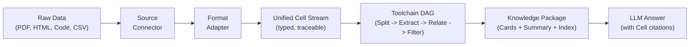

# LitePaperReader

> **Universal Data Flow Intelligence Engine** — a type-safe, traceable, composable pipeline
> for processing large documents, code repositories, and structured data into LLM-consumable knowledge.

[](pyproject.toml)
[](LICENSE)
[](tests/)
[](https://github.com/ASDNNB/litepaperreader/actions/workflows/ci.yml)

English | [中文](README_CN.md)

---

## Why LitePaperReader?

Traditional RAG systems treat documents as opaque text blobs — they chunk blindly, embed vaguely, and retrieve by fuzzy similarity. You get an answer but can't trace it back to the source.

**LitePaperReader** takes a different approach: instead of guessing, it converts raw data into a typed, traceable data flow, extracts structured information, and answers questions with precise source citations.

- **Type-safe Cells** — Every data unit has a typed ``ContentType`` (TEXT / CODE / TABLE). Processing strategy is driven by type, not guesswork.
- **Immutable Provenance** — Every output traces back to its exact source coordinates. The source text stays read-only.
- **Composable DAG Pipeline** — Tools are arranged in a directed acyclic graph. The same data can flow through different paths.
- **Model-Agnostic** — Each tool independently selects its model size: 7B for bulk filtering, GPT-4 for precision extraction, MiniLM for embeddings.

---

## Architecture



Each stage produces a typed, traceable output that feeds into the next.

---

## Features

### Data Ingestion
- **Multi-format Support** — HTML, PDF, CSV, XLSX, Python, JavaScript, Rust, Go, and more.
- **Source Connectors** — Scan local filesystems, Git repositories, and web pages.
- **VirtualPurifier** — Interval-based dirty-data removal without modifying source text.

### Structured Extraction
- **SchemaRegistry** — Dynamic Pydantic model generation from YAML / Python templates.
- **SchemaExtractor** — 4 backends: ``mock`` (keyword), ``ollama`` (local), ``instructor`` (structured), ``json`` (API).
- **Cross-document Analysis** — ``RelationBuilder`` finds keyword and dependency links across sources.

### Retrieval & QA
- **HybridRetriever** — BM25 lexical + MiniLM semantic with RRF fusion (no external vector DB).
- **AnswerGenerator** — 4 backends with cell-level source citations.
- **KnowledgePackage** — Structured cards + summary tree + provenance map.

### LLM Integration
- **MCP Server** — Exposes 4 tools (analyze / detail / search / answer) via Model Context Protocol.
- **File Watcher** — Auto-processes directory changes into a persistent SQLite index.
- **Python API & CLI** — Programmatic access to every pipeline stage.

### Operations
- **YAML Configuration** — Single ``litepaper_config.yaml`` controls pipeline, model, and watch mode.
- **Docker Support** — Ready-to-use ``Dockerfile`` and ``docker-compose.yml``.
- **Web UI** — Zero-dependency web interface at ``http://localhost:8765``.

---

## Quick Start

### Install

```bash
git clone https://github.com/ASDNNB/litepaperreader
cd litepaperreader
pip install -e .
```

### Process a document

```python
from litepaperreader.pipeline.orchestrator import DataPipeline
from litepaperreader.pipeline.splitters import SemanticSplitter
from litepaperreader.core.schema import SchemaRegistry, SchemaTemplate, FieldSpec
from litepaperreader.knowledge.answer import AnswerGenerator
from litepaperreader.connectors.base import ResourceRef
import asyncio

# 1. Define extraction schema
reg = SchemaRegistry()
reg.register(SchemaTemplate("paper", "Academic paper", (
    FieldSpec("method", "Core method used"),
    FieldSpec("finding", "Key result"),
)))

# 2. Build pipeline
pipeline = DataPipeline()
pipeline.add_default_adapters()
pipeline.toolchain.add_tool(SemanticSplitter())
pipeline.with_schema_extractor(reg, "paper", mode="mock")

# 3. Process & answer
async def run():
    ref = ResourceRef("test", "/doc.html", content_type_hint="html")
    kp = await pipeline.run_raw(ref, b"<html><body><p>A novel method for deep learning achieves 95% accuracy.</p></body></html>")
    gen = AnswerGenerator(mode="mock")
    return await gen.answer("What method and result?", kp)

answer = asyncio.run(run())
print(answer.text)       # Answer with cell citations
print(answer.citations)  # [Citation(cell_id="...", text="...")]
```

### MCP Server (LLM Plugin)

Start the server:

```bash
python mcp_server.py --db index.db --watch-dir ./docs
```

Any MCP-compatible host (Codex CLI, Claude Desktop, Cursor) can then invoke the four tools:

```json
{
  "mcp_servers": [{
    "name": "litepaperreader",
    "command": {"command": "python", "args": ["mcp_server.py"]}
  }]
}
```

### Web UI

```bash
python webui.py
# Open http://localhost:8765
```

---

## Installation

### Core
```bash
pip install -e .
```
Requires Python 3.11+.

### Optional dependencies
```bash
pip install -e .[pdf]      # PDF support (docling)
pip install -e .[embed]    # Semantic embeddings (sentence-transformers)
pip install -e .[code]     # Code parsing (tree-sitter)
pip install -e .[web]      # Web scraping (trafilatura)
pip install -e .[yaml]     # YAML config (pyyaml)
pip install -e .[all]      # Everything
```

### Docker
```bash
docker-compose up
```

---

## Configuration

Create ``litepaper_config.yaml``:

```yaml
pipeline:
  schema: paper
  extraction_mode: mock
model:
  mode: ollama
  name: llama3.2
  api_base: http://localhost:11434
watch:
  dir: ./docs
  interval: 30
  db: index.db
```

Then start with ``mcp_server.py --config litepaper_config.yaml``.

---

## Project Structure

```
litepaperreader/
├── core/              Cell types, SchemaRegistry, VirtualPurifier, HybridRetriever
├── connectors/        FileSystem, Git, Web — source discovery
├── adapters/          HTML, Table, Code, PDF — format conversion
├── pipeline/          Tool DAG, DataPipeline, Splitters, Extractor, Filters, Watcher
├── knowledge/         KnowledgePackage, AnswerGenerator
├── schemas/           YAML schema template examples
mcp_server.py          MCP protocol server
webui.py + webui_template.html   Web interface
tests/                 91 tests
```

---

## Tests

```bash
pytest tests/ -v
```

91 passing, 4 skipped (requires optional dependencies: pyyaml, Ollama).

---

## FAQ

**Q: How is this different from LangChain / LlamaIndex?**
A: LitePaperReader operates at a lower level — it's a data processing pipeline that converts raw data into structured, traceable cells before any LLM call. LangChain solves "how to call LLMs," LitePaperReader solves "how to prepare data for LLMs."

**Q: Do I need a GPU?**
A: No. The core pipeline runs on CPU. Semantic embeddings are optional and can run on CPU via MiniLM. Model-dependent features (Ollama, OpenAI) use external services.

**Q: What file formats are supported?**
A: HTML, CSV, XLSX, Parquet, Python, JavaScript, TypeScript, Rust, Go, Java, C/C++, PDF (with docling), and plain text.

**Q: Can I use this with local LLMs?**
A: Yes. Set ``mode="ollama"`` and point to your local Ollama instance.

---

## Contributing

Contributions welcome! Please read [CONTRIBUTING.md](CONTRIBUTING.md) first.

---

## License

[MIT](LICENSE) © LitePaperReader
