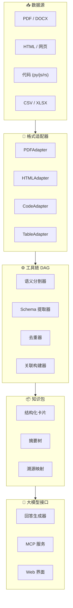

<div align="center">
  <br/>
  <h1>⚡ LitePaperReader</h1>
  <p><strong>通用数据流智能引擎</strong></p>
  <p>
    <em>类型安全 &bull; 可溯源 &bull; 可组合 — 将文档、代码和结构化数据转化为大模型可消费的知识。</em>
  </p>
  <br/>

[](pyproject.toml)
[](LICENSE)
[](https://github.com/ASDNNB/litepaperreader/actions/workflows/test.yml)
[](https://github.com/ASDNNB/litepaperreader/actions/workflows/lint.yml)
[](docker-compose.yml)
[](CONTRIBUTING.md)

[📖 文档](#-文档) &bull;
[🚀 快速开始](#-快速开始) &bull;
[🔧 安装](#-安装) &bull;
[💡 使用](#-使用指南) &bull;
[🤝 参与贡献](CONTRIBUTING.md)

[English](README.md)

</div>

---

## 📋 目录

- [为什么选择 LitePaperReader？](#-为什么选择-litepaperreader)
- [架构](#-架构)
- [功能特性](#-功能特性)
- [安装](#-安装)
- [快速开始](#-快速开始)
- [使用指南](#-使用指南)
- [MCP 集成](#-mcp-集成)
- [Web 界面](#-web-界面)
- [配置](#-配置)
- [常见问题](#-常见问题)
- [路线图](#-路线图)
- [参与贡献](#-参与贡献)
- [许可证](#-许可证)

---

## 🧠 为什么选择 LitePaperReader？

传统 RAG 系统把文档当作不透明的文本块 — 盲切块、模糊嵌入、模糊匹配。你得到一个回答，但无法追溯到来源。

> **LitePaperReader** 换了一种思路：它将原始数据转换为**类型化、可溯源的统一数据流**，提取结构化信息，并给出带**精确坐标引用**的回答。

| | 传统 RAG | LitePaperReader |
|---|---|---|
| **数据模型** | 不透明的文本块 | 类型化 Cell（文本 / 代码 / 表格） |
| **溯源能力** | 嵌入后丢失 | 每个输出可追溯到精确行号 |
| **处理流程** | 固定管道（切块 → 嵌入 → 检索） | 可编程 DAG（拆分 → 提取 → 关联 → 过滤） |
| **模型使用** | 单一模型包办一切 | 每个工具独立选择模型大小 |
| **向量数据库** | 必需（Pinecone、Chroma 等） | 不需要（BM25 + MiniLM，零基础设施） |
| **安装** | 重（多云依赖） | 轻量（pip install，随处运行） |

---

## 🏗 架构

<div align="center">



</div>

**工作流程：**

1. **连接器**从文件系统、Git 仓库或网页发现数据
2. **适配器**将每种格式转化为类型化 Cell（文本/代码/表格）
3. **工具链 DAG** 通过可编程管道处理 Cell（拆分 → 提取 → 关联 → 过滤）
4. **知识包**将结果组装为带完整溯源的结构化卡片
5. **大模型接口**通过 Python API、MCP 协议或 Web 界面提供服务

每个 Cell 携带 `SourceRef` — 精确的文件路径、行号范围和处理血统。没有任何信息丢失。

---

## ✨ 功能特性

### 📄 数据摄入
- **多格式支持**：HTML、PDF、CSV、XLSX、Python、JavaScript、Rust、Go 等
- **智能连接器**：文件系统（glob）、Git（工作树）、Web（HTTP + sitemap）
- **VirtualPurifier**：基于区间的噪声去除，不修改源文本

### 🎯 结构化提取
- **SchemaRegistry**：从 YAML/Python 模板动态生成 Pydantic 模型
- **4 种提取后端**：mock（关键字）、ollama（本地 LLM）、instructor（结构约束）、json（API）
- **跨文档分析**：RelationBuilder 自动发现跨文档的关键词和引用关系

### 🔍 检索与问答
- **混合检索器**：BM25 词汇 + MiniLM 语义 + RRF 融合 — 无需向量数据库
- **回答生成器**：4 种后端，回答带 Cell 级引用
- **知识包**：结构化卡片 + 摘要树 + 溯源映射

### 🤖 大模型集成
- **MCP 服务**：通过 Model Context Protocol 暴露 4 个工具
- **文件监控**：目录变化自动处理并持久化到 SQLite
- **Python API & CLI**：程序化访问所有管道阶段

### 🛠 运维
- **YAML 配置**：单个 `litepaper_config.yaml` 控制所有设置
- **Docker 支持**：开箱即用的 `Dockerfile` 和 `docker-compose.yml`
- **Web 界面**：零依赖浏览器界面，访问 `http://localhost:8765`

---

## 📦 安装

### 方式一：一键安装脚本（推荐）

```bash
# macOS / Linux
curl -sSL https://raw.githubusercontent.com/ASDNNB/litepaperreader/master/get-litepaperreader.py | python3

# Windows PowerShell
curl.exe -sSL https://raw.githubusercontent.com/ASDNNB/litepaperreader/master/get-litepaperreader.py | python3
```

一键脚本将自动完成：
1. 检查 Python 3.11+ ✅
2. 下载项目（git 或 ZIP）✅
3. 创建虚拟环境 ✅
4. 询问要安装的可选功能 ✅
5. 创建启动脚本 ✅

### 方式二：Windows .exe 安装器

从 [Releases](https://github.com/ASDNNB/litepaperreader/releases) 页面下载 `LitePaperReader_Setup.exe`。直接运行 — 无需安装 Python。

### 方式三：pip 本地安装

```bash
git clone https://github.com/ASDNNB/litepaperreader.git
cd litepaperreader
pip install -e .
```

### 方式四：Docker

```bash
docker-compose up
```

打开 http://localhost:8765

### 可选依赖

| 组件 | 命令 | 说明 |
|---|---|---|
| PDF | `pip install -e .[pdf]` | 处理 PDF 文档 |
| 嵌入 | `pip install -e .[embed]` | 语义搜索（~1 GB 下载） |
| 代码 | `pip install -e .[code]` | 用 tree-sitter 解析代码 |
| 网页 | `pip install -e .[web]` | 抓取网页 |
| YAML | `pip install -e .[yaml]` | YAML 配置支持 |
| 全部 | `pip install -e .[all]` | 以上所有功能 |

---

## 🚀 快速开始

### Python API 处理文档

```python
from litepaperreader.pipeline.orchestrator import DataPipeline
from litepaperreader.core.schema import SchemaRegistry, SchemaTemplate, FieldSpec
from litepaperreader.knowledge.answer import AnswerGenerator
from litepaperreader.connectors.base import ResourceRef
import asyncio

# 1. 定义提取 Schema
registry = SchemaRegistry()
registry.register(SchemaTemplate("paper", "学术论文字段", (
    FieldSpec("method", "核心方法"),
    FieldSpec("finding", "关键结果"),
    FieldSpec("limitation", "局限性", expression="limitation|future work"),
)))

# 2. 构建管道
pipeline = DataPipeline()
pipeline.add_default_adapters()
pipeline.with_schema_extractor(registry, "paper", mode="mock")

# 3. 运行
async def run():
    kp = await pipeline.run_raw(
        ResourceRef("doc", "/paper.html", content_type_hint="html"),
        b"<html><body><p>本文提出了一种新的深度学习方法，准确率达95%...</p></body></html>",
    )
    return await AnswerGenerator(mode="mock").answer(
        "提出了什么方法？结果如何？", kp
    )

answer = asyncio.run(run())
print(answer.text)       # 带源引用的回答
print(answer.citations)  # [CellRef(source='...', line=42, ...)]
```

### 启动 MCP 服务（为大模型宿主）

```bash
python mcp_server.py --db index.db --watch-dir ./docs
```

任何兼容 MCP 的宿主（Claude Desktop、Cursor、Codex CLI）都可以使用你的文档。

---

## 💡 使用指南

### Python API

```python
from litepaperreader.pipeline import DataPipeline, SemanticSplitter
from litepaperreader.connectors.filesystem import FileSystemConnector

# 扫描目录
connector = FileSystemConnector(include=["src/**/*.py", "docs/**/*.md"])
for ref in connector.scan("/my/project"):
    print(f"发现: {ref.path}")

# 构建自定义管道
pipeline = DataPipeline()
pipeline.add_default_adapters()
pipeline.add_tool(SemanticSplitter(max_chunk_size=512))
```

### CLI 使用

```bash
# 处理单个文件
python -c "from litepaperreader.pipeline.orchestrator import DataPipeline; ..."

# 运行测试
pytest tests/ -v

# 启动 Web 界面
python webui.py
```

### YAML 配置

所有管道行为可通过 `litepaper_config.yaml` 配置：

```yaml
pipeline:
  extractor_mode: mock  # mock | ollama | instructor | json
  splitter:
    max_chunk_size: 512
    overlap: 32

model:
  ollama:
    endpoint: http://localhost:11434
    model: qwen2.5:7b
```

---

## 🔌 MCP 集成

LitePaperReader 实现了 [Model Context Protocol](https://modelcontextprotocol.io)，让任何 MCP 兼容的宿主可以使用你处理过的文档。

### 暴露的工具

| 工具 | 说明 |
|---|---|
| `analyze_document` | 处理文档并返回结构化卡片 |
| `get_cell_detail` | 获取指定 Cell 的完整内容和元数据 |
| `search_content` | 跨所有已索引文档进行混合搜索 |
| `answer_question` | 回答问题，回答带源引用 |

### Claude Desktop

添加到 `claude_desktop_config.json`：

```json
{
  "mcpServers": {
    "litepaperreader": {
      "command": "python",
      "args": ["/path/to/mcp_server.py", "--db", "index.db", "--watch-dir", "./docs"]
    }
  }
}
```

---

## 🌐 Web 界面

启动零依赖的浏览器界面：

```bash
python webui.py
```

在浏览器中打开 http://localhost:8765。

Web 界面提供：
- 📂 文件上传和处理
- 📋 Schema 构建器（定义要提取的内容）
- 🔍 全文搜索
- ❓ 带引用的问答
- 📊 管道可视化

---

## ⚙️ 配置

所有配置集中在 `litepaper_config.yaml`：

```yaml
# 文件系统连接器
connectors:
  filesystem:
    include: ["*.pdf", "*.html", "*.py", "*.csv"]
    exclude: ["node_modules/**", ".git/**"]

# 管道设置
pipeline:
  extractor_mode: mock    # mock | ollama | instructor | json
  splitter:
    max_chunk_size: 512
    overlap: 32

# 嵌入设置
embedding:
  backend: minilm         # minilm | openai
  model: all-MiniLM-L6-v2

# 监控模式
watch:
  directories:
    - ./docs
  interval: 30
```

---

## ❓ 常见问题

**问：需要 GPU 吗？**
答：不需要。核心管道在 CPU 上运行。MiniLM 嵌入模型很小（~80 MB）。可选的 LLM 后端（Ollama、OpenAI）可以远程运行。

**问：需要 API 密钥吗？**
答：不需要。使用 `mode="mock"`，提取通过关键字匹配工作 — 无需模型。生产环境推荐 Ollama（本地、免费）或 OpenAI（云端）。

**问：和 LangChain / LlamaIndex 有什么区别？**
答：LitePaperReader 不是构建 LLM 链的框架。它是**数据预处理引擎**，将原始数据转换为结构化、可溯源的知识。可以理解为面向大模型的 ETL 工具。

**问：可以作为 Codex 插件使用吗？**
答：可以！使用 MCP 服务或项目自带的 `.codex-plugin/` 清单。

**问：支持哪些文件格式？**
答：PDF、HTML、CSV、XLSX、Python、JavaScript、Rust、Go 等。每种格式都有专用的适配器。

---

## 🗺 路线图

### v1.0 — 当前版本
- [x] 核心数据类型（Cell、SourceRef、ContentType）
- [x] VirtualPurifier（基于区间的噪声去除）
- [x] SchemaRegistry（动态 Pydantic 模型）
- [x] 混合检索器（BM25 + MiniLM + RRF）
- [x] 工具链 DAG（可组合管道）
- [x] Schema 提取器（4 种后端）
- [x] 回答生成器（4 种后端，带引用）
- [x] MCP 服务
- [x] Web 界面
- [x] 跨平台安装器（引导脚本 + .exe）

### v1.1 — 下一版本
- [ ] CodeAdapter 真正的 tree-sitter 多语言 AST 解析
- [ ] 跨文档 RelationBuilder（完整实现）
- [ ] 增量处理 / 监控模式
- [ ] 真实模型集成测试（Ollama + OpenAI）

### v2.0 — 未来规划
- [ ] 自定义 Tool 插件系统
- [ ] 分布式处理（多工作节点）
- [ ] 知识图谱导出（Neo4j / NetworkX）
- [ ] 可视化管道编辑器

---

## 🤝 参与贡献

欢迎贡献！详见 [CONTRIBUTING.md](CONTRIBUTING.md)：

- 开发环境搭建指南
- 代码风格规范（ruff）
- 测试要求
- PR 工作流

### 贡献者快速开始

```bash
git clone https://github.com/ASDNNB/litepaperreader.git
cd litepaperreader
pip install -e .[dev]
pytest tests/ -v
```

---

## 📄 许可证

MIT &copy; LitePaperReader。详见 [LICENSE](LICENSE)。

---

<div align="center">
  <sub>
    为开源 AI 社区而建 ❤️
    <br/>
    如果觉得有用，<a href="https://github.com/ASDNNB/litepaperreader">⭐ star 本项目</a>！
  </sub>
</div>
